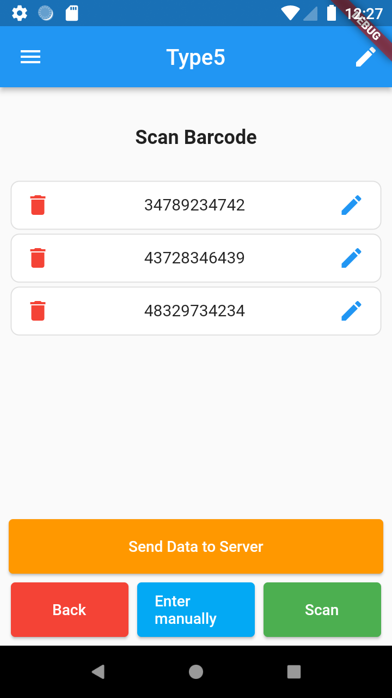

# Zebra Scanner Example 
Modular Flutter project with some examples. 


## Installation

  ```
  1) Clone this repository
  2) Run: flutter pub get
  3) Run: flutter pub run fast_i18n
  4) Run: flutter pub run build_runner build --delete-conflicting-outputs
  5) Run: cp lib/settings.dart.example lib/settings.dart
  6) Edit lib/settings.dart file for correct run
  7) Setup and run mock server
  ```

## Setup mock server

  1) Install [Mocko](https://mocko.dev/docs/getting-started/standalone/)
  2) Run: ./run-mock-server.sh

## Codes 
  ```
  ML123 : User login 
  ```

## Update application
After update icon, splash screen or app name, run command:
```
bash update-app.sh
```


## Features
 - Authorization
 - Device registration
 - Barcodes module example
 - Other module example
 - Main menu
 - Support for more languages
 - Settings
 - Logging
 - Error exception handling with sentry


## Screenshots
<table>
 <tr><td>
   
 </td><td>
   
 </td><td>
   
 </td></tr>
 <tr><td>
   
 </td><td>
   
 </td><td>
   
 </td></tr>
</table>

## Special thanks

 - [Dart](https://dart.dev/): Client-optimized language for fast apps on any platform.
 - [Flutter](https://flutter.dev/): UI toolkit for building beautiful, natively compiled applications for mobile, web, and desktop from a single codebase.
 - [Sentry](https://sentry.io): Real-time crash reporting for your web apps, mobile apps, and games.
 - [Modular](https://pub.dev/packages/flutter_modular): Package for Automatic Memory Management, Dependency Injection, Routing and Code Modularization.
 - [Triple](https://pub.dev/packages/flutter_triple): Implementation of the Segmented State Pattern.
 - [fast_i18n](https://pub.dev/packages/fast_i18n): Localization / Internationalization (i18n) solution.
 - [dio_http](https://pub.dev/packages/dio_http): A powerful Http client for Dart.
 - [my_logger](https://pub.dev/packages/my_logger): Fork of Flogs package that provides quick & simple logging solution.

## Contributing
Pull requests are welcome.
For major changes, please open an issue first to discuss what you would like to change.


## Author

👤 **Martin Jablečník**

* Website: [martin-jablecnik.cz](https://www.martin-jablecnik.cz)
* Github: [@mjablecnik](https://github.com/mjablecnik)


